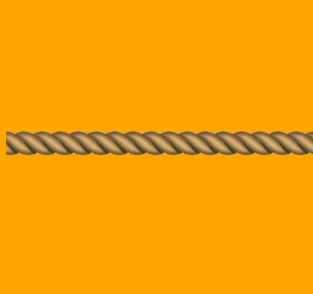
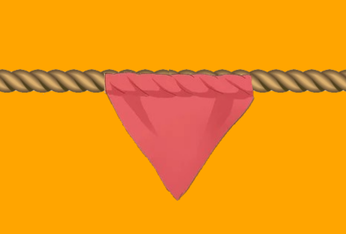
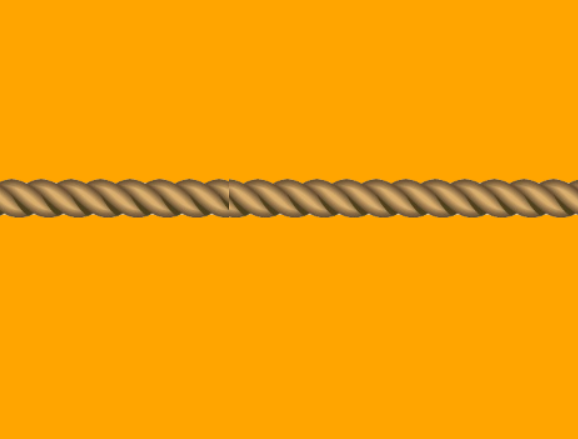
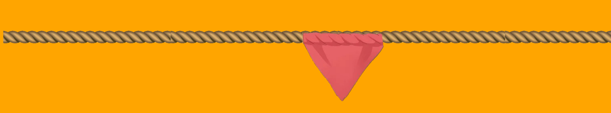

# Onathon_CET😍-OnamPro
# Tug of Words_Onam Edition😋
## Technologies Used💎
- HTML
- CSS
- JAVASCRIPT
### How it Works?!🤔🛠
- When players click "start game", the game page should load.
- When players enter the correct answer, the flag is pulled left.
- When players enter the incorrect answer, the flag is pulled right.
- When a player clicks the "new word" button, a new scrambled word appears.
- If the players get the flag to their side, load the player winner screen.
- If the players lose to the machine, load the machine winner screen.






## How to configure:🧐

**1.** Clone this repository to your local drive
```shell
 $ git clone https://github.com/Meghaanil/Onathon_CET.git
```
**2.** Move to the directory

```
$ cd Onathon_CET/
```

Hosted Website available at 👇

### [Click Me👀](https://meghaanil.github.io/Onathon_CET/)

 
<p align="center">
 ⭐🌟 Star this repository if you find it useful.🌟⭐
</p>
